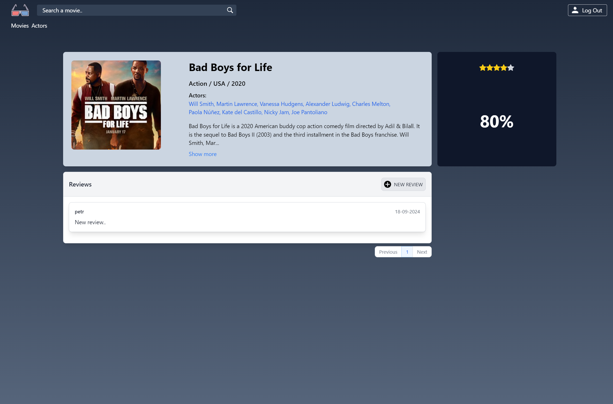
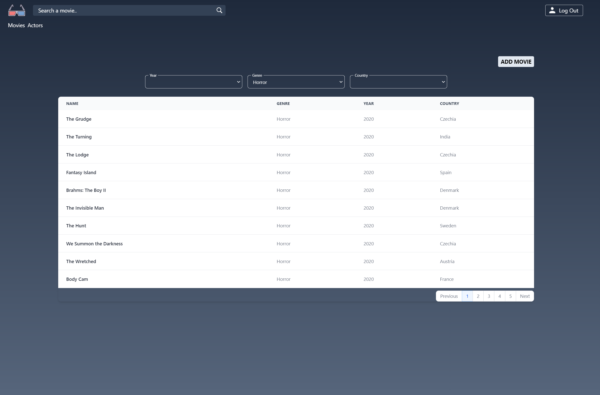

##  About




## Navigation
- [Install](#install)
- [Docker install](#docker-install)

## Install

Clone or download project repository

### Laravel
Go to the laravel file
```shell
cd laravel
```
Install dependencies
```shell
composer install
```
Create .env file and generate key
```shell
cp .env.example .env
php artisan key:generate
```
Setup your sql database in .env file

Create storage symlink
```shell
php artisan storage:link
```
Start migration
```shell
php artisan migrate
```
Start database seeder
```shell
php artisan db:seed
```
Start artisan server
```shell
php artisan serve
```

### Nuxt
Go to the nuxt file
```shell
cd nuxt
```
Install dependencies
```shell
npm install
```
Start nuxt
```shell
npm run dev
```


## Docker install

To build the docker containers, follow these steps:

```shell
# Open a terminal (Command Prompt or PowerShell for Windows, Terminal for macOS or Linux)

# Build application
docker-compose build

# Start containers
docker-compose up -d

# Create .env file and generate key
docker-compose exec laravel sh -c "cp .env.example .env && php artisan key:generate"

# Create symlink and seed database
docker-compose exec laravel sh -c "php artisan storage:link && php artisan migrate && php artisan db:seed"
```